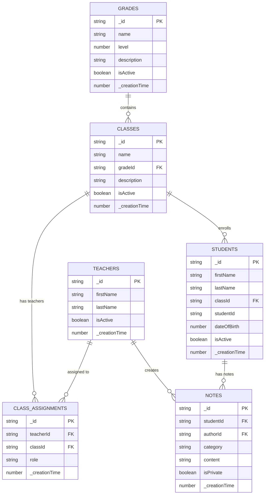

# Data Model

## Convex Schema Overview

The NorthPark Learning Support application uses Convex as the datastore and ORM with the following core entities:

- **Teachers** (Staff members)
- **Grades** (K-9)
- **Classes** (belong to grades)
- **ClassAssignments** (link teachers to classes)
- **Students** (belong to classes)
- **Notes** (created by teachers about students)

## Entity Relationship Diagram



**Note**: Convex automatically adds `_creationTime` to the end of every index, so it should not be explicitly included in index definitions. For example, the `by_student_created` index on the NOTES table only includes `["studentId"]` in the definition, but Convex automatically appends `_creationTime` for sorting.

## Convex Schema Definitions

### Users (Teachers)

**Purpose**: Store teacher account information and authentication data

```typescript
// convex/schema.ts
import { defineSchema, defineTable } from "convex/server";
import { v } from "convex/values";

export default defineSchema({
  users: defineTable({
    email: v.string(),
    name: v.string(),
    passwordHash: v.optional(v.string()), // NULL if using OAuth only
    image: v.optional(v.string()), // Profile picture URL
    role: v.union(v.literal("TEACHER"), v.literal("ADMIN")),
    isActive: v.boolean(),
    emailVerified: v.optional(v.number()), // Timestamp
  })
    .index("by_email", ["email"])
    .index("by_role", ["role"])
    .index("by_active", ["isActive"]),
});
```

**Fields**:
- `_id`: Unique identifier (Convex-generated)
- `email`: Teacher's email address (unique, used for login)
- `name`: Teacher's full name
- `passwordHash`: Hashed password (optional for OAuth-only users)
- `image`: Optional profile picture URL
- `role`: User role ('TEACHER' or 'ADMIN')
- `isActive`: Whether the account is active
- `emailVerified`: Email verification timestamp
- `_creationTime`: Account creation timestamp (Convex auto-generated)

**Relationships**:
- One-to-many with ClassAssignments
- One-to-many with Notes

### Grades

**Purpose**: Define grade levels (K-9) for organizing classes and students

```typescript
// convex/schema.ts
grades: defineTable({
  name: v.string(), // 'Kindergarten', '1st Grade', etc.
  level: v.number(), // 0 for K, 1-9 for grades
  description: v.optional(v.string()),
  isActive: v.boolean(),
})
  .index("by_level", ["level"])
  .index("by_active", ["isActive"]),
```

**Fields**:
- `_id`: Unique identifier (Convex-generated)
- `name`: Human-readable grade name
- `level`: Numeric level (0 for Kindergarten, 1-9 for grades)
- `description`: Optional description
- `isActive`: Whether the grade is currently used
- `_creationTime`: Creation timestamp (Convex auto-generated)

**Relationships**:
- One-to-many with Classes

**Sample Data**:
```typescript
// convex/seed.ts
export const seedGrades = [
  { name: 'Kindergarten', level: 0, description: 'Pre-school grade', isActive: true },
  { name: '1st Grade', level: 1, description: 'First grade', isActive: true },
  { name: '2nd Grade', level: 2, description: 'Second grade', isActive: true },
  { name: '3rd Grade', level: 3, description: 'Third grade', isActive: true },
  { name: '4th Grade', level: 4, description: 'Fourth grade', isActive: true },
  { name: '5th Grade', level: 5, description: 'Fifth grade', isActive: true },
  { name: '6th Grade', level: 6, description: 'Sixth grade', isActive: true },
  { name: '7th Grade', level: 7, description: 'Seventh grade', isActive: true },
  { name: '8th Grade', level: 8, description: 'Eighth grade', isActive: true },
  { name: '9th Grade', level: 9, description: 'Ninth grade', isActive: true },
];
```

### Classes

**Purpose**: Organize students into manageable groups within grade levels

```typescript
// convex/schema.ts
classes: defineTable({
  name: v.string(), // 'Class A', 'Room 101', etc.
  gradeId: v.id("grades"),
  description: v.optional(v.string()),
  isActive: v.boolean(),
})
  .index("by_grade", ["gradeId"])
  .index("by_active", ["isActive"]),
```

**Fields**:
- `_id`: Unique identifier (Convex-generated)
- `name`: Class name or identifier
- `gradeId`: Reference to grades table
- `description`: Optional class description
- `isActive`: Whether the class is currently active
- `_creationTime`: Creation timestamp (Convex auto-generated)

**Relationships**:
- Many-to-one with Grades
- One-to-many with Students
- Many-to-many with Users (through ClassAssignments)

### ClassAssignments

**Purpose**: Link teachers to classes they teach (many-to-many relationship)

```typescript
// convex/schema.ts
classAssignments: defineTable({
  userId: v.id("users"),
  classId: v.id("classes"),
  role: v.string(), // 'teacher' | 'assistant'
})
  .index("by_user", ["userId"])
  .index("by_class", ["classId"])
  .index("by_user_class", ["userId", "classId"]),
```

**Fields**:
- `_id`: Unique identifier (Convex-generated)
- `userId`: Reference to users table
- `classId`: Reference to classes table
- `role`: Teacher's role in the class
- `_creationTime`: Assignment creation timestamp (Convex auto-generated)

**Relationships**:
- Many-to-one with Users
- Many-to-one with Classes

### Students

**Purpose**: Store student information and link them to classes

```typescript
// convex/schema.ts
students: defineTable({
  firstName: v.string(),
  lastName: v.string(),
  classId: v.id("classes"),
  studentId: v.optional(v.string()), // Optional school student ID
  dateOfBirth: v.optional(v.number()), // Timestamp
  isActive: v.boolean(),
})
  .index("by_class", ["classId"])
  .index("by_active", ["isActive"])
  .index("by_name", ["lastName", "firstName"]),
```

**Fields**:
- `_id`: Unique identifier (Convex-generated)
- `firstName`: Student's first name
- `lastName`: Student's last name
- `classId`: Reference to classes table
- `studentId`: Optional school-assigned student ID
- `dateOfBirth`: Optional date of birth (timestamp)
- `isActive`: Whether the student is currently enrolled
- `_creationTime`: Creation timestamp (Convex auto-generated)

**Relationships**:
- Many-to-one with Classes
- One-to-many with Notes

### Notes

**Purpose**: Store teacher observations and notes about students

```typescript
// convex/schema.ts
notes: defineTable({
  studentId: v.id("students"),
  authorId: v.id("users"),
  category: v.union(
    v.literal("ACADEMIC"),
    v.literal("BEHAVIOR"),
    v.literal("SOCIAL"),
    v.literal("HEALTH"),
    v.literal("OTHER")
  ),
  content: v.string(),
  isPrivate: v.boolean(),
})
  .index("by_student", ["studentId"])
  .index("by_author", ["authorId"])
  .index("by_category", ["category"])
  .index("by_student_created", ["studentId", "_creationTime"]),
```

**Fields**:
- `_id`: Unique identifier (Convex-generated)
- `studentId`: Reference to students table
- `authorId`: Reference to users table (teacher who created the note)
- `category`: Note category for organization
- `content`: Note content (rich text)
- `isPrivate`: Whether the note is private to the author
- `_creationTime`: Note creation timestamp (Convex auto-generated)

**Relationships**:
- Many-to-one with Students
- Many-to-one with Users (author)

## Complete Convex Schema

```typescript
// convex/schema.ts
import { defineSchema, defineTable } from "convex/server";
import { v } from "convex/values";

export default defineSchema({
  users: defineTable({
    email: v.string(),
    name: v.string(),
    passwordHash: v.optional(v.string()),
    image: v.optional(v.string()),
    role: v.union(v.literal("TEACHER"), v.literal("ADMIN")),
    isActive: v.boolean(),
    emailVerified: v.optional(v.number()),
  })
    .index("by_email", ["email"])
    .index("by_role", ["role"])
    .index("by_active", ["isActive"]),

  grades: defineTable({
    name: v.string(),
    level: v.number(),
    description: v.optional(v.string()),
    isActive: v.boolean(),
  })
    .index("by_level", ["level"])
    .index("by_active", ["isActive"]),

  classes: defineTable({
    name: v.string(),
    gradeId: v.id("grades"),
    description: v.optional(v.string()),
    isActive: v.boolean(),
  })
    .index("by_grade", ["gradeId"])
    .index("by_active", ["isActive"]),

  classAssignments: defineTable({
    userId: v.id("users"),
    classId: v.id("classes"),
    role: v.string(),
  })
    .index("by_user", ["userId"])
    .index("by_class", ["classId"])
    .index("by_user_class", ["userId", "classId"]),

  students: defineTable({
    firstName: v.string(),
    lastName: v.string(),
    classId: v.id("classes"),
    studentId: v.optional(v.string()),
    dateOfBirth: v.optional(v.number()),
    isActive: v.boolean(),
  })
    .index("by_class", ["classId"])
    .index("by_active", ["isActive"])
    .index("by_name", ["lastName", "firstName"]),

  notes: defineTable({
    studentId: v.id("students"),
    authorId: v.id("users"),
    category: v.union(
      v.literal("ACADEMIC"),
      v.literal("BEHAVIOR"),
      v.literal("SOCIAL"),
      v.literal("HEALTH"),
      v.literal("OTHER")
    ),
    content: v.string(),
    isPrivate: v.boolean(),
  })
    .index("by_student", ["studentId"])
    .index("by_author", ["authorId"])
    .index("by_category", ["category"])
    .index("by_student_created", ["studentId", "_creationTime"]),
});
```

## Convex Indexes

### Performance Indexes

Convex automatically creates indexes based on the schema definitions above. The key indexes include:

```typescript
// User authentication
.index("by_email", ["email"])
.index("by_role", ["role"])
.index("by_active", ["isActive"])

// Class assignments
.index("by_user", ["userId"])
.index("by_class", ["classId"])
.index("by_user_class", ["userId", "classId"])

// Student queries
.index("by_class", ["classId"])
.index("by_active", ["isActive"])
.index("by_name", ["lastName", "firstName"])

// Note queries
.index("by_student", ["studentId"])
.index("by_author", ["authorId"])
.index("by_category", ["category"])
.index("by_student_created", ["studentId", "_creationTime"])

// Class queries
.index("by_grade", ["gradeId"])
.index("by_active", ["isActive"])

// Grade queries
.index("by_level", ["level"])
.index("by_active", ["isActive"])
```

## Data Validation Rules

### User Validation
- Email must be valid format and unique
- Name must be at least 2 characters
- Role must be 'teacher' or 'admin'
- Password hash required for non-OAuth users

### Student Validation
- First and last names required
- Must belong to an active class
- Student ID must be unique within school (if provided)
- Date of birth must be valid date

### Note Validation
- Content must be at least 10 characters
- Category must be valid enum value
- Student and author must exist and be active
- Content cannot exceed 10,000 characters

### Class Validation
- Name must be unique within grade
- Must belong to an active grade
- Name must be at least 2 characters

## Sample Data

### Grades
```sql
INSERT INTO grades (id, name, level, description) VALUES
('grade-k', 'Kindergarten', 0, 'Pre-school grade'),
('grade-1', '1st Grade', 1, 'First grade'),
('grade-2', '2nd Grade', 2, 'Second grade'),
('grade-3', '3rd Grade', 3, 'Third grade'),
('grade-4', '4th Grade', 4, 'Fourth grade'),
('grade-5', '5th Grade', 5, 'Fifth grade'),
('grade-6', '6th Grade', 6, 'Sixth grade'),
('grade-7', '7th Grade', 7, 'Seventh grade'),
('grade-8', '8th Grade', 8, 'Eighth grade'),
('grade-9', '9th Grade', 9, 'Ninth grade');
```

### Sample Classes
```sql
INSERT INTO classes (id, name, grade_id, description) VALUES
('class-k-a', 'Kindergarten A', 'grade-k', 'Morning kindergarten class'),
('class-k-b', 'Kindergarten B', 'grade-k', 'Afternoon kindergarten class'),
('class-1-a', '1st Grade A', 'grade-1', 'First grade class A'),
('class-1-b', '1st Grade B', 'grade-1', 'First grade class B');
```

## Convex Functions

### Query Functions

```typescript
// convex/users.ts
import { query } from "./_generated/server";
import { v } from "convex/values";

export const getByEmail = query({
  args: { email: v.string() },
  handler: async (ctx, args) => {
    return await ctx.db
      .query("users")
      .withIndex("by_email", (q) => q.eq("email", args.email))
      .first();
  },
});

export const getActiveUsers = query({
  handler: async (ctx) => {
    return await ctx.db
      .query("users")
      .withIndex("by_active", (q) => q.eq("isActive", true))
      .collect();
  },
});
```

### Mutation Functions

```typescript
// convex/users.ts
import { mutation } from "./_generated/server";
import { v } from "convex/values";

export const create = mutation({
  args: {
    email: v.string(),
    name: v.string(),
    role: v.union(v.literal("TEACHER"), v.literal("ADMIN")),
  },
  handler: async (ctx, args) => {
    return await ctx.db.insert("users", {
      ...args,
      isActive: true,
    });
  },
});

export const update = mutation({
  args: {
    id: v.id("users"),
    name: v.optional(v.string()),
    isActive: v.optional(v.boolean()),
  },
  handler: async (ctx, args) => {
    const { id, ...updates } = args;
    return await ctx.db.patch(id, updates);
  },
});
```

## Migration Strategy

### Initial Setup
1. Define schema in `convex/schema.ts`
2. Create seed data functions for grades (K-9)
3. Deploy schema to Convex
4. Run seed functions to populate initial data

### Future Schema Changes
- Add new fields to existing tables
- Create new tables as needed
- Add new indexes for performance
- Update validation rules in functions

## Data Security Considerations

### Access Control
- Teachers can only access their assigned classes
- Notes are private to the author unless marked otherwise
- Admin users have full access to all data

### Data Encryption
- Sensitive data encrypted at rest
- All communications over HTTPS
- Password hashes use bcrypt with salt

### Audit Trail
- All data modifications logged
- User actions tracked for security
- Regular backup and recovery procedures
